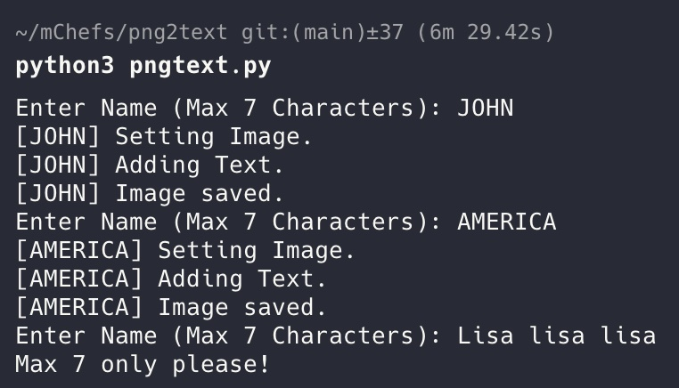

# png2text

This is a tool I created to help streamline the import of photos to a UV printer software. The tool converts text that user inputs into a png with transparent background. This should work on most versions of Python

# Features
## Highly configurable options
The tool uses `json` for config and enables options for the user to configure including canvas size, positioning and font size

## Configs available
```json
{
	"CANVAS_WIDTH":210,
	"CANVAS_HEIGHT":297,
	"TEXT_HEIGHT":250,
	"DIST_FROM_TOP":30,
	"DIST_FROM_LEFT":150,
	"TEXT_LENGTH":50,
	"FONT_COLOR":"(0,0,0)"
}
unit is in mm
```

## Custom Fonts
The tool accepts customs TrueType Font to generate PNGs with. Supply one `.ttf` before running and the tool will automatically use it.

## Requirements
```bash
$ pip install pillow
```
no other dependencies required

## Running
```bash
python3 png2text.py

```



## TODO
- add basic colors in text and converts to rgb codes